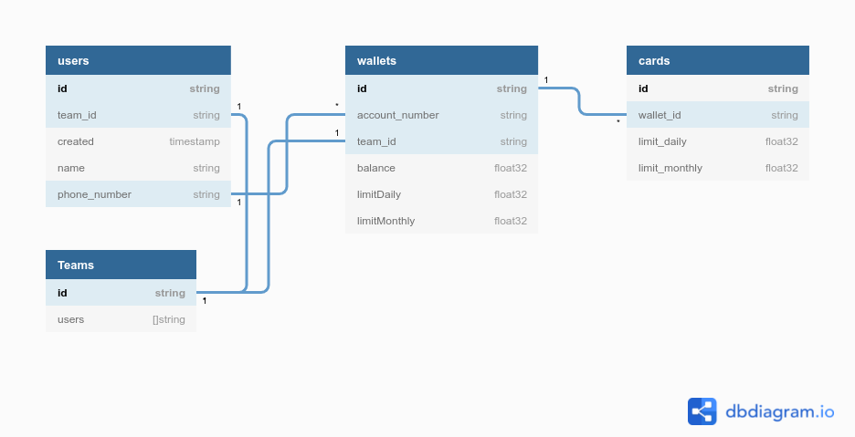

# Spenmo Backend Basic Test

## Contents
1. [Binary Search Tree](#binary-search-tree)
   * [Problem Statement](#1-problem-statement)
   * [Solution](#1-solution)
   * [Run the Program](#1-run)
3. [Array Sequence](#array-sequence)
   * [Problem Statement](#2-problem-statement)
   * [Solution](#2-solution)
   * [Run the Program](#2-run)
5. [Backend Database Schema](#backend-database-schema)
6. [Backend Architecture Service](#backend-architecture-service)
    * [Prerequisite](#4-prerequisite)
    * [System Architecture](#4-system-architecture)
      * [API Gateway](#4-2-api-gateway)
      * [User Service](#4-2-user-service)
      * [Wallet Service](#4-2-wallet-service)
      * [Card Service](#4-2-card-service)
      * [Transaction Service](#4-2-transaction-service)
        * [Purchase](#4-2-5-purchase)
        * [Topup](#4-2-5-topup)

```
/spenmo-backend-basic-test
├── 01_Binary_Search_Tree
├── 02_Array_Sequence
├── 03_Backend_Database_Schema
├── 04_Backend_Architecture_Service
└── README.md

4 directories, 1 file
```

<a name="binary-search-tree"/>   

## 1. Binary Search Tree

<a name="1-problem-statement"/>  

### Problem Statement
[](https://mermaid.live/edit#eyJjb2RlIjoiZ3JhcGggVERcbiAgICBIZWFkKCgxNikpIC0tLSBMMSgoNykpXG4gICAgSGVhZCgoMTYpKSAtLS0gUjEoKDEwMCkpXG4gICAgTDEgLS0tIEwyKCgxKSlcbiAgICBMMSAtLS0gUjIoKDEwKSlcbiAgICBSMiAtLS0gTDMoKDgpKVxuICAgIFIyIC0tLSBSMygoMTQpKVxuICAiLCJtZXJtYWlkIjoie1xuICBcInRoZW1lXCI6IFwiZGVmYXVsdFwiXG59IiwidXBkYXRlRWRpdG9yIjpmYWxzZSwiYXV0b1N5bmMiOnRydWUsInVwZGF0ZURpYWdyYW0iOmZhbHNlfQ)

Search item: 14
Return true if the number is found

tree.Find(6) ⇒ true  
tree.Find(7) ⇒ true  
tree.Find(8) ⇒ true  
tree.Find(9) ⇒ false  
tree.Find(10) ⇒ true  
tree.Find(14) ⇒ true  

```go
type TreeNode struct {
    Val   int
    Left  *TreeNode
    Right *TreeNode
}
```

```go
func searchBST(root *TreeNode, val int) *TreeNode {
  // Complete function block
}
```
<a name="1-solution"/> 

### Solution

<a name="1-run"/> 

### Run the Program
From the root of this repository, navigate to folder 01_Binary_Search_Tree
```bash
/spenmo-backend-basic-test$ cd 01_Binary_Search_tree
```
List of contents of the directory will be as follow:
```
/spenmo-backend-basic-test/01_Binary_Search_Tree
├── 01_Binary_Search_Tree
    ├── coverage.out
    ├── entity
    │   ├── tree.go
    │   └── tree_test.go
    ├── go.mod
    ├── go.sum
    ├── main.go
    └── Makefile  
├── 02_Array_Sequence
├── 03_Backend_Database_Schema
├── 04_Backend_Architecture_Service
└── README.md

1 directory, 7 files
```

Run the program by executing makefile script as follow:
```bash
/spenmo-backend-basic-test/01_Binary_Search_Tree$ make run
```
To run unit test and generate code coverage profile run this:
```bash
/spenmo-backend-basic-test/01_Binary_Search_Tree$ make test
```

<a name="array-sequence"/>  

## 2. Array Sequence

<a name="2-problem-statement"/> 

### Problem Statement
Int [] main = new int[] {20, 7, 8, 10, 2, 5, 6} // non repeating numbers  
Int [] seq= new int [] {1,4}  
sequenceExists(main, [7,8]) ⇒ true  
sequenceExists(main, [8, 7]) ⇒ false  
sequenceExists(main, [7, 10]) ⇒ false  

```go
func sequenceExists(data []int, input []int) bool {
  // Complete function block
}
```
<a name="2-solution"/> 

### Solution

<a name="2-run"/> 

### Run the Program
From the root of this repository, navigate to folder 02_Array_Sequence
```bash
/spenmo-backend-basic-test$ cd 02_Array_Sequence
```
List of contents of the directory will be as follow:
```
/spenmo-backend-basic-test/02_Array_Sequence
├── 01_Binary_Search_Tree
├── 02_Array_Sequence
    ├── coverage.out
    ├── go.mod
    ├── go.sum
    ├── main.go
    ├── Makefile
    └── usecase
        ├── sequence.go
        └── sequence_test.go
├── 03_Backend_Database_Schema
├── 04_Backend_Architecture_Service
└── README.md

1 directory, 7 files
```

Run the program by executing makefile script as follow:
```bash
/spenmo-backend-basic-test/02_Array_Sequence$ make run
```
To run unit test and generate code coverage profile run this:
```bash
/spenmo-backend-basic-test/02_Array_Sequence$ make test
```

<a name="backend-database-schema"/>

## 3. Backend Database Schema
### Problem Statement
Design schema for the following :  
  * There is a list of users, each user can have many wallets. 
  * Each wallet holds the balance amount the user has. 
  * Each wallet has many cards. 
  * Each card can have limits - limit on money that can be spent daily, monthly.  
  * Each user can also be part of 1 or more teams. Each team has a wallet. 
  * Team wallets have also have daily, monthly limits 
 
Sample schema expected  
### Solution


<a name="backend-architecture-service"/>

## 4. Backend Architecture Service
### Problem Statement
Based on your schema #3, write CRUD APIs for the user’s cards (you can use any languages you’re comfortable with but Golang would be
preferred). You can either submit the Github link or zip folder. Write any assumptions that you have in README.md  

Some things that we’d like to see on the project:
1. Brief explanation of your project structure / design pattern that you
implemented
2. Short manual to run the application
3. Testing (unit test, integration test, etc)
4. Observability plan. Explain (or even implement) your observability
plan in the codebase/README.md
5. API documentation (REST API/gRPC/Pub Sub/etc). You can choose
any format you like including README.md
6. [Bonus] Implement API rate limiting
### Solution

<a name="4-prerequisite"/> 

### Prerequisite
1.  Please make sure you have [Go](https://golang.org/doc/install) installed on your system.
2.  Please make sure you have [Docker](https://docs.docker.com/engine/install/) installed on your system.
3.  Please make sure you have [Docker Compose](https://docs.docker.com/compose/install/) installed on your system.
4.  Please make sure you have [gRPC Go Plugin](https://grpc.io/docs/languages/go/quickstart/) installed on your system.
5.  Please make sure you have [grpcurl](https://github.com/fullstorydev/grpcurl) installed on your system. It is a command-line tools to communicate to gRPC server.

<a name="4-system-architecture"/>

### System Architecture


<a name="4-2-api-gateway"/>

#### API Gateway

* POST /v1/users, register new user
```
curl -X POST \
  http://localhost:9080/v1/users \
  -H 'Content-Type: application/json' \
  -H 'cache-control: no-cache' \
  -d '{
	"name": "John Banting",
	"phoneNumber": "08121234567",
	"email": "john.banting@gmailcom",
	"dob": "01-05-2000"
}
'
```

* GET /v1/users, get all registered users
```
curl -X GET \
  http://localhost:9080/v1/users \
  -H 'cache-control: no-cache'
```

* POST /v1/wallets, create new wallet
```
curl -X POST \
  http://localhost:9080/v1/wallets \
  -H 'Content-Type: application/json' \
  -H 'cache-control: no-cache' \
  -d '{
	"accountNumber": "08121234567",
	"name": "Group1",
	"maxLimit": 1000000
}'
```

* GET /v1/wallets, get all registered wallets
```
curl -X GET \
  http://localhost:9080/v1/wallets/ \
  -H 'cache-control: no-cache'
```

* GET /v1/wallets/user/:accountNumber, get wallet by user's account number
```
curl -X GET \
  http://localhost:9080/v1/wallets/user/08121234567 \
  -H 'cache-control: no-cache'
```

<a name="4-2-user-service"/>

#### User Service


<a name="4-2-wallet-service"/>

#### Wallet Service


<a name="4-2-card-service"/>

#### Card Service


<a name="4-2-transaction-service"/>

#### Transaction Service


<a name="4-2-5-purchase"/>

##### Purchase Sequence Diagram
[![](https://mermaid.ink/img/eyJjb2RlIjoic2VxdWVuY2VEaWFncmFtXG4gIHBhcnRpY2lwYW50IEEgYXMgQVBJIEdhdGV3YXlcbiAgcGFydGljaXBhbnQgVCBhcyBUcmFuc2FjdGlvbiBTZXJ2aWNlXG4gIHBhcnRpY2lwYW50IEMgYXMgQ2FyZCBTZXJ2aWNlXG4gIHBhcnRpY2lwYW50IFcgYXMgV2FsbGV0IFNlcnZpY2VcbiAgcGFydGljaXBhbnQgQ0RCIGFzIENhcmQgRGF0YWJhc2VcbiAgcGFydGljaXBhbnQgV0RCIGFzIFdhbGxldCBEYXRhYmFzZVxuICAgIEEtPj4rVDogUHVyY2hhc2UgUmVxdWVzdFxuICAgIFQtPj4rQzogSW5xdWlyeSBDYXJkXG4gICAgQy0-PitDREI6IFF1ZXJ5IENhcmRcbiAgICBDREItLT4-LUM6IFJldHVybiBRdWVyeVxuICAgIEMtLT4-LVQ6IFJldHVybiBDYXJkXG4gICAgVC0-PitUOiBDaGVjazogUHVyY2hhc2UgQW1vdW50ICB2cyBDYXJkIExpbWl0XG4gICAgVC0-PitXOiBJbnF1aXJ5IEJhbGFuY2VcbiAgICBXLT4-K1dEQjogUXVlcnkgV2FsbGV0XG4gICAgV0RCLS0-Pi1XOiBSZXR1cm4gUXVlcnlcbiAgICBXLS0-Pi1UOiBSZXR1cm4gQmFsYW5jZVxuICAgIFQtPj4rVDogQ2hlY2s6IFB1cmNoYXNlIEFtb3VudCB2cyBCYWxhbmNlXG4gICAgVC0-PitXOiBEZWR1Y3QgQmFsYW5jZVxuICAgIFctPj4rV0RCOiBVcGRhdGUgQmFsYW5jZVxuICAgIFdEQi0tPj4tVzogUmV0dXJuIFVwZGF0ZSBTdGF0dXNcbiAgICBXLS0-Pi1UOiBSZXR1cm4gRGVkdWN0IEJhbGFuY2UgU3RhdHVzXG4gICAgVC0tPj5BOiBQdXJjaGFzZSBSZXNwb25zZVxuICAgICAgICAgICAgIiwibWVybWFpZCI6eyJ0aGVtZSI6ImRlZmF1bHQifSwidXBkYXRlRWRpdG9yIjpmYWxzZSwiYXV0b1N5bmMiOnRydWUsInVwZGF0ZURpYWdyYW0iOmZhbHNlfQ)](https://mermaid.live/edit/#eyJjb2RlIjoic2VxdWVuY2VEaWFncmFtXG4gIHBhcnRpY2lwYW50IEEgYXMgQVBJIEdhdGV3YXlcbiAgcGFydGljaXBhbnQgVCBhcyBUcmFuc2FjdGlvbiBTZXJ2aWNlXG4gIHBhcnRpY2lwYW50IEMgYXMgQ2FyZCBTZXJ2aWNlXG4gIHBhcnRpY2lwYW50IFcgYXMgV2FsbGV0IFNlcnZpY2VcbiAgcGFydGljaXBhbnQgQ0RCIGFzIENhcmQgRGF0YWJhc2VcbiAgcGFydGljaXBhbnQgV0RCIGFzIFdhbGxldCBEYXRhYmFzZVxuICAgIEEtPj4rVDogUHVyY2hhc2UgUmVxdWVzdFxuICAgIFQtPj4rQzogSW5xdWlyeSBDYXJkXG4gICAgQy0-PitDREI6IFF1ZXJ5IENhcmRcbiAgICBDREItLT4-LUM6IFJldHVybiBRdWVyeVxuICAgIEMtLT4-LVQ6IFJldHVybiBDYXJkXG4gICAgVC0-PitUOiBDaGVjazogUHVyY2hhc2UgQW1vdW50ICB2cyBDYXJkIExpbWl0XG4gICAgVC0-PitXOiBJbnF1aXJ5IEJhbGFuY2VcbiAgICBXLT4-K1dEQjogUXVlcnkgV2FsbGV0XG4gICAgV0RCLS0-Pi1XOiBSZXR1cm4gUXVlcnlcbiAgICBXLS0-Pi1UOiBSZXR1cm4gQmFsYW5jZVxuICAgIFQtPj4rVDogQ2hlY2s6IFB1cmNoYXNlIEFtb3VudCB2cyBCYWxhbmNlXG4gICAgVC0-PitXOiBEZWR1Y3QgQmFsYW5jZVxuICAgIFctPj4rV0RCOiBVcGRhdGUgQmFsYW5jZVxuICAgIFdEQi0tPj4tVzogUmV0dXJuIFVwZGF0ZSBTdGF0dXNcbiAgICBXLS0-Pi1UOiBSZXR1cm4gRGVkdWN0IEJhbGFuY2UgU3RhdHVzXG4gICAgVC0tPj5BOiBQdXJjaGFzZSBSZXNwb25zZVxuICAgICAgICAgICAgIiwibWVybWFpZCI6IntcbiAgXCJ0aGVtZVwiOiBcImRlZmF1bHRcIlxufSIsInVwZGF0ZUVkaXRvciI6ZmFsc2UsImF1dG9TeW5jIjp0cnVlLCJ1cGRhdGVEaWFncmFtIjpmYWxzZX0)

<a name="4-2-5-topup"/>

##### Topup Sequence Diagram
[![](https://mermaid.ink/img/eyJjb2RlIjoic2VxdWVuY2VEaWFncmFtXG4gIHBhcnRpY2lwYW50IEEgYXMgQVBJIEdhdGV3YXlcbiAgcGFydGljaXBhbnQgVCBhcyBUcmFuc2FjdGlvbiBTZXJ2aWNlXG4gIHBhcnRpY2lwYW50IFUgYXMgVXNlciBTZXJ2aWNlXG4gIHBhcnRpY2lwYW50IFcgYXMgV2FsbGV0IFNlcnZpY2VcbiAgcGFydGljaXBhbnQgVURCIGFzIFVzZXIgRGF0YWJhc2VcbiAgcGFydGljaXBhbnQgV0RCIGFzIFdhbGxldCBEYXRhYmFzZVxuICAgIEEtPj4rVDogVG9wdXAgUmVxdWVzdFxuICAgIFQtPj4rVTogSW5xdWlyeSBVc2VyXG4gICAgVS0-PitVREI6IFF1ZXJ5IFVzZXJcbiAgICBVREItLT4-LVU6IFJldHVybiBRdWVyeVxuICAgIFUtLT4-LVQ6IFJldHVybiBVc2VyXG4gICAgVC0-PitUOiBDaGVjazogVXNlciBpcyBFeGlzdFxuICAgIFQtPj4rVzogSW5xdWlyeSBCYWxhbmNlXG4gICAgVy0-PitXREI6IFF1ZXJ5IFdhbGxldFxuICAgIFdEQi0tPj4tVzogUmV0dXJuIFF1ZXJ5XG4gICAgVy0tPj4tVDogUmV0dXJuIEJhbGFuY2VcbiAgICBULT4-K1c6IEFkZCBCYWxhbmNlXG4gICAgVy0-PitXREI6IFVwZGF0ZSBCYWxhbmNlXG4gICAgV0RCLS0-Pi1XOiBSZXR1cm4gVXBkYXRlIFN0YXR1c1xuICAgIFctLT4-LVQ6IFJldHVybiBBZGQgQmFsYW5jZSBTdGF0dXNcbiAgICBULS0-PkE6IFRvcHVwIFJlc3BvbnNlXG4gICAgICAgICAgICAiLCJtZXJtYWlkIjp7InRoZW1lIjoiZGVmYXVsdCJ9LCJ1cGRhdGVFZGl0b3IiOmZhbHNlLCJhdXRvU3luYyI6dHJ1ZSwidXBkYXRlRGlhZ3JhbSI6ZmFsc2V9)](https://mermaid.live/edit/#eyJjb2RlIjoic2VxdWVuY2VEaWFncmFtXG4gIHBhcnRpY2lwYW50IEEgYXMgQVBJIEdhdGV3YXlcbiAgcGFydGljaXBhbnQgVCBhcyBUcmFuc2FjdGlvbiBTZXJ2aWNlXG4gIHBhcnRpY2lwYW50IFUgYXMgVXNlciBTZXJ2aWNlXG4gIHBhcnRpY2lwYW50IFcgYXMgV2FsbGV0IFNlcnZpY2VcbiAgcGFydGljaXBhbnQgVURCIGFzIFVzZXIgRGF0YWJhc2VcbiAgcGFydGljaXBhbnQgV0RCIGFzIFdhbGxldCBEYXRhYmFzZVxuICAgIEEtPj4rVDogVG9wdXAgUmVxdWVzdFxuICAgIFQtPj4rVTogSW5xdWlyeSBVc2VyXG4gICAgVS0-PitVREI6IFF1ZXJ5IFVzZXJcbiAgICBVREItLT4-LVU6IFJldHVybiBRdWVyeVxuICAgIFUtLT4-LVQ6IFJldHVybiBVc2VyXG4gICAgVC0-PitUOiBDaGVjazogVXNlciBpcyBFeGlzdFxuICAgIFQtPj4rVzogSW5xdWlyeSBCYWxhbmNlXG4gICAgVy0-PitXREI6IFF1ZXJ5IFdhbGxldFxuICAgIFdEQi0tPj4tVzogUmV0dXJuIFF1ZXJ5XG4gICAgVy0tPj4tVDogUmV0dXJuIEJhbGFuY2VcbiAgICBULT4-K1c6IEFkZCBCYWxhbmNlXG4gICAgVy0-PitXREI6IFVwZGF0ZSBCYWxhbmNlXG4gICAgV0RCLS0-Pi1XOiBSZXR1cm4gVXBkYXRlIFN0YXR1c1xuICAgIFctLT4-LVQ6IFJldHVybiBBZGQgQmFsYW5jZSBTdGF0dXNcbiAgICBULS0-PkE6IFRvcHVwIFJlc3BvbnNlXG4gICAgICAgICAgICAiLCJtZXJtYWlkIjoie1xuICBcInRoZW1lXCI6IFwiZGVmYXVsdFwiXG59IiwidXBkYXRlRWRpdG9yIjpmYWxzZSwiYXV0b1N5bmMiOnRydWUsInVwZGF0ZURpYWdyYW0iOmZhbHNlfQ)
